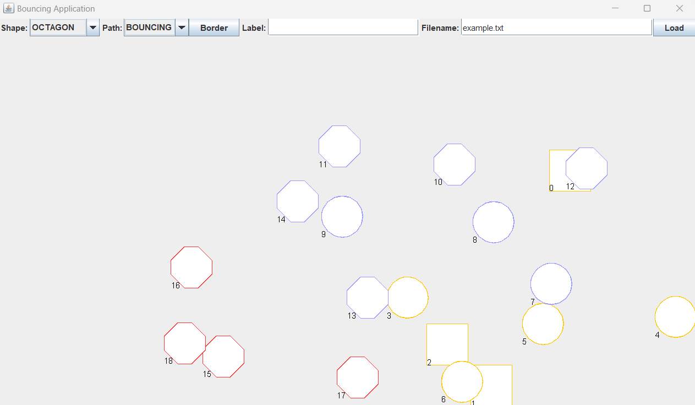

# Shape Game
Shape game in java

## About

This project is part of a university project in which we experimented with GUI programming using Java AWT and Swing frameworks. This GUI application consists of a game in which the user can create shapes by selecting a shape type from the combo box, and pressing the panel. The user can choose between rectangle, oval and octagon shapes and can choose the shapes to either follow two paths which are floating or bouncing. The user is able to change the border colour of shapes and the labels of shapes. The user can also load in shapes from a file provided it follows the format of a txt with each line containing SHAPENAME, SHAPEPATH as specified in the example text files.

The full list of functionalities can be found here

* Users can create shapes
* Users can specify the colours of shapes
* Users can choose if shapes have a floating or bouncing path/movement
* Users can change the label of shapes
* Users can load in shapes from a file that is in the same format as example files

## How to set up 

In order to set this up you will need Java setup and this application was built in JDK 17. You will need to gather the Java class files under this repository and compile and run the code.

Find out how to run and compile java code here
